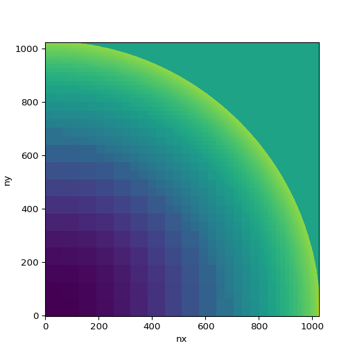

# Running a parallel job on `adroit`

We now describe how to run a parallel jon on the `adroit` cluster. First we need to compile our code using the MPI library. For this, go back in the `ramses/bin` directory and type:
```
$ module load openmpi/gcc/4.1.0
$ make clean
$ make NDIM=2 MPI=1
```
This will produce the executable `ramses2d` that we will launch using the MPI runtime environement.

For this, type:
```
$ cd ..
$ srun -n 8 -t 00:10:00 bin/ramses2d namelist/sedov2d.nml > run.log
```
This should have produced two new directories called `output_00001` and `output_00002`. These are called _snapshots_ as they contain the fluid data at the initial time and at the final time. We will now visualize the final snapshot using a combination of tools.

First, type in the Terminal window:
```
./utils/f90/amr2map -inp output_00002 -out dens.map -typ 1
```
This produces a map stored in the binary file `dens.map`. Then type (you need `anaconda` to be properly loaded for this):
```
./utils/py/map2img.py dens.map --log --out dens.png
```
This produces the following `png` image of the density field at the final time of the simulation.



