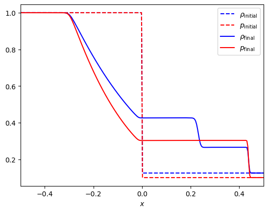

# Hydro Simulations with Athena++

[`Ramses`](https://bitbucket.org/rteyssie/ramses) is one great example of public astrophysical fluid dynamics codes. 
[`Athena++`](https://github.com/PrincetonUniversity/athena) is another good code developed by Princeton members. Let's try this one too!

## Download code

```
git clone https://github.com/PrincetonUniversity/athena
```

## 1D Sod shock tube simulation

### Compile

Move to the `athena` root directory.

```
cd athena
```

Remember you `configure` your problem and `compile` (or make) always on the `athena` root directory.

```
python configure.py --prob shock_tube
make all -j
```

For other examples, see this [tutorial](https://github.com/PrincetonUniversity/athena/wiki/Tutorial)

### Run

```
cd bin
./athena -i ../inputs/hydro/athinput.sod
```

If you will see this log message, the run is successful:
```
...
cycle=167 time=2.3924135897968676e-01 dt=1.4248457181159216e-03
cycle=168 time=2.4066620469780267e-01 dt=1.4248481920288011e-03
cycle=169 time=2.4209105288983146e-01 dt=1.4248546356682343e-03
cycle=170 time=2.4351590752549970e-01 dt=1.4248645562391438e-03
cycle=171 time=2.4494077208173884e-01 dt=1.4248675424398205e-03
cycle=172 time=2.4636563962417865e-01 dt=1.4248749883828658e-03
cycle=173 time=2.4779051461256152e-01 dt=1.4248833647748065e-03
cycle=174 time=2.4921539797733633e-01 dt=7.8460202266367185e-04
cycle=175 time=2.5000000000000000e-01 dt=1.4248899766177968e-03
Terminating on time limit
time=2.5000000000000000e-01 cycle=175
tlim=2.5000000000000000e-01 nlim=-1
zone-cycles = 44800
cpu time used  = 1.9675000000000002e-02
zone-cycles/cpu_second = 2.2770012706480301e+06
```

### Visualize with gnuplot

```
gnuplot -e 'set term jpeg; plot "Sod.block0.out1.00025.tab" using 2:3 ' > density.jpeg
```

or you can use python plotting script provided by the code

```
../vis/python/plot_lines.py \
  Sod.block0.out1.00000.tab,,Sod.block0.out1.00025.tab, \
  x1v \
  rho,press,rho,press \
  lines.png \
  --styles=--,--,-,- \
  --colors b,r,b,r \
  --labels '$\rho_\mathrm{initial}$,$p_\mathrm{initial}$,$\rho_\mathrm{final}$,$p_\mathrm{final}$' \
  --x_min=-0.5 \
  --x_max=0.5 \
  --x_label '$x$'
```



## 2D Orszag Tang Vortex

### Compile a parallel job

Move to the `athena` root directory. If you were on `athena/bin/` to run the example above, you may want to do

```
cd ../
```

Load `openmpi` and `hdf5` modules:

```
module load openmpi/gcc/4.1.0
module load hdf5/gcc/openmpi-4.1.0/1.10.6
```

Then, configure and compile. Don't forget to clean.

```
./configure.py --prob=orszag_tang -b -hdf5 -mpi --lib_path=$HDF5DIR/lib64
make clean
make all -j
```

### Run

> Important!!
> You may begin to filling up your storage quota, which is 100GB. To run larger simulations, you may want to do this on `scratch` directory.
> Check your quota with
> ```
> checkquota
> ```
> Run your jobs on `/scratch/network/your_user_name`

Let's move to the scratch directory. 

```
cd /scratch/network/your_user_name
```

Then, copy the executable and input files to the scratch directory.

```
cp ~/athena/bin/athena .
cp ~/athena/input/mhd/athinput.orszag-tang .
```

Let's run the job with 8 cores.

```
srun -n 8 -t 00:10:00 ./athena -i ./athinput.orszag-tang meshblock/nx1=100 meshblock/nx2=50 mesh/nx1=200 mesh/nx2=200 output2/file_type=hdf5 
```

### Visualization one snapshot

You will need additional python package `h5py`. To install it under your conda environment, you can do either

```
conda install h5py
```

or

```
pip install h5py
```

For one snapsthot, you can use a provided python script. 

```
~/athena/vis/python/plot_slice.py \
  OrszagTang.out2.00100.athdf \
  press \
  slice.png \
  --colormap plasma \
  --vmin 0.0 \
  --vmax 0.36 \
```

Modifying `movie.sh` script created in the previous session, we can also generate a time series of images. Let's save the following to `movie_athena.sh`.

```sh
#!/bin/bash
PID=OrszagTang
ATHENA_HOME=~/athena
for i in `ls -d $PID.out2.00*.athdf`
do
    echo $i
    $ATHENA_HOME/vis/python/plot_slice.py $i press slice_$i.png --colormap plasma --vmin 0.0 --vmax 0.36 
done
echo "converting to animated gif"
convert -delay 1 slice_$PID.*.png $PID.gif
rm -rf slice_$PID*
```

Run the script:

```
source movie_athena.sh
```


